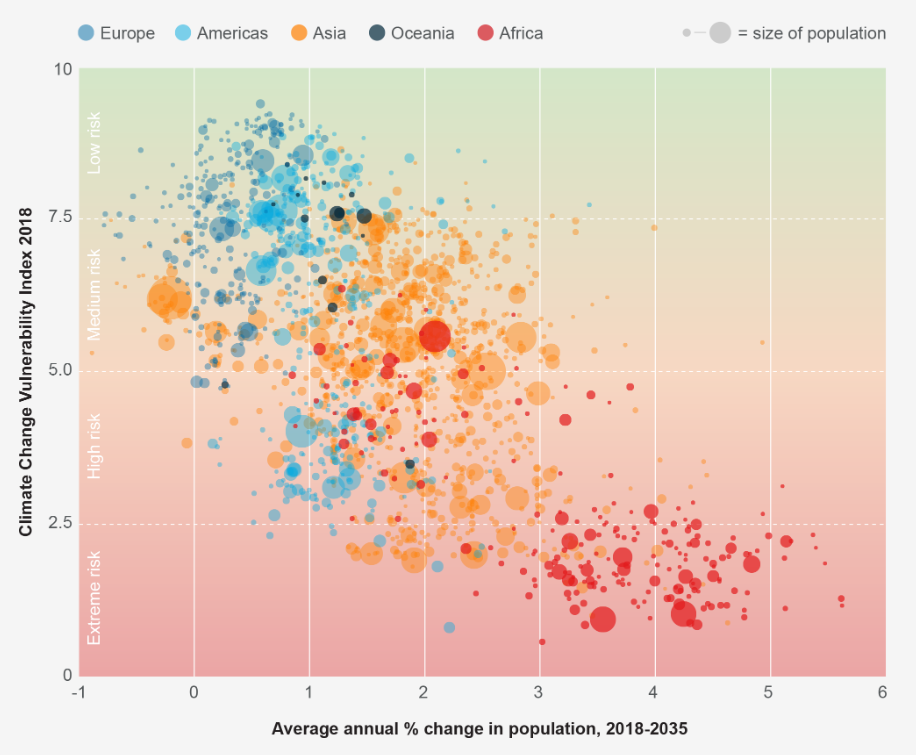
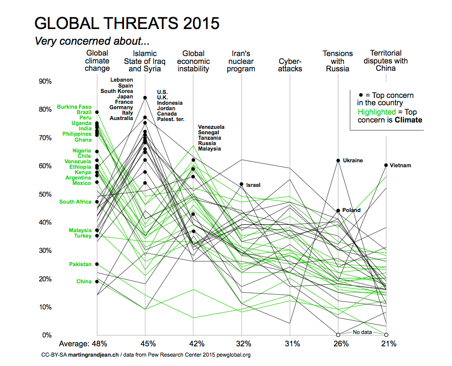
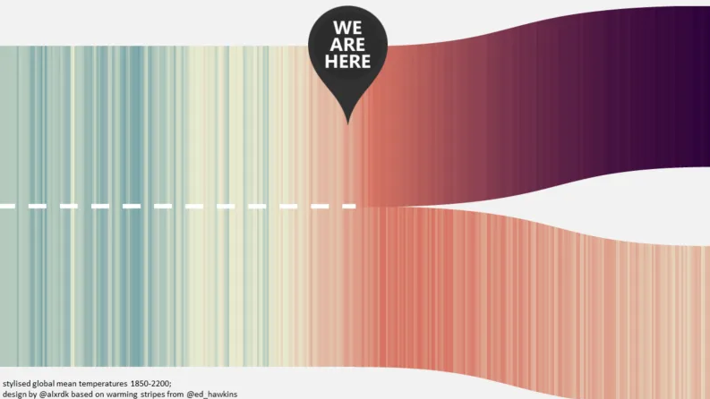

# Self Study Project

## Framework for visualization

### Purpose and audience
Before evaluating any visualization, we should consider the purpose and audience of that visualization. It is very important to understand what the purpose was of creating the visualization and what story the creator of the visualization is trying to tell us, is the creator trying to educate, inform or explore on the given topic. The visualization should also be judged based on the background of the audience and their understanding of the given area of specialization. These two factors contribute a lot based on the type and density of content being displayed in the visualization.

### Aesthetic appeal
The aesthetic appeal of any drawing depends on the look and feel of the visualization; it is important with respect to the visualization because it helps in making the first impression on the audience of the visualization. 

### Understandability
The understandability of any visualization deals with the effort needed for the audience to understand the visualization; the visualization can be considered a good visualization even if it can be understood after a short study of the visualization.

### Addition of Value
It is important for any visualization to add significant insight or understanding about the topics that are not attainable from the original representation of data it was derived from, that maybe text, reports, transcript or tables.

### Evaluating Alternatives
It would be better to use alternative visualization for the representation of data if the data can be represented in a way such that it is easier to comprehend and provides better readability.

### Representing Information
It is important for the information to extract new information from the data and highlight the important information while providing the context of the information. If the visualization transforms the information in any way then it should not mislead the audience rather it should helpfully simplifying. It should not omit important information.

### Visual Components
The visualization should transform nominal, quantitative and interval data properly and represent the transformed data using proper lines, colors, and formatting. The legends and labels should also provide contextual information about the data being represented.

## Visualizations representing Climate Change

### Climate change vs % population change

This visualization successfully shows the correlation between the vulnerability to climate change with the percentage of population change. The audience for this is general public and this visualization is quite easy to comprehend. The color combination used is also good which determines which region represents more vulnerability to climate change. The visualization is easy to comprehend. I feel that the scale for climate change should have been the other way i.e.  lower number should have represented lower vulnerability to climate change. It is also tough to determine the which spot represents which country, hovering over the spots should have given information about the countries. The visualization should have pointed the significant far outliers.

### Climate change vs ISIS

This visualization is part of a series of visualizations which aim to represent that most countries see climate change a bigger threat as compared to the ISIS. The visualization has very good labels and legends. It is quite understandable and adds a lot of value to the data it is coming from. The visualization has a lot of intersecting lines due to which it is difficult to determine each individual line, the visualization should have had a functionality to highlight a line when it is hovered upon to show where it is coming from. Also the data set considered has 40,000 people surveyed from 40 countries, which is like 1100 people from each country at an average, this does not necessarily determine the opinion of the whole nation.  Other than that it is a good visualization for a general audience. 

### Warming strips extension

The visualization shown is an extension of the warming strips and is a beautiful representation of what could be the future. The visualization is very clean and uses colors that are resonant to the climate changes. The visualization implicitly determines two different futures without using any quantitative data. A good addition to this visualization would be points on the X axis representing the year, and a general relation between the color and the corresponding temperature change.

### Temperature anomalies by country

This visualization gives country-wise climate change, the general audience can easily comprehend the information provided in this visualization, the color combination is good, and the data representation has been good, the main objective can be clearly picked out that all of the countries have rising temperature changes. A good addition to the visualization would be region-wise climate change visualization which shows world map and the consequent climate changes.

## Overall assessment and Conclusion
All the visualizations given above have a great depiction of data and successfully convey the message through the visualizations, but almost all the visualizations can be improved to a certain extent based on the evaluation framework. It is also important to note that how change in the climate can be presented in various ways to convey the same message. The audience for all these visualizations was general public because the topic ‘Climate Change’ effects all of us and the visualizations should be such that are easily understood by everyone. The aesthetic appeal of all these visualizations is good and the color combination used resonates the effects to be shown in the visualizations. Most of the visualizations add significant insights to the data they were derived from and highlight the important information considering the context.

## References
	1.	https://www.coursera.org/lecture/data-results/14-evaluating-visualizations-IBuU3
	2.	http://citeseerx.ist.psu.edu/viewdoc/download;jsessionid=53E1CDEABEFCC98737EBC8365E4518B9?doi=10.1.1.98.5350&rep=rep1&type=pdf

